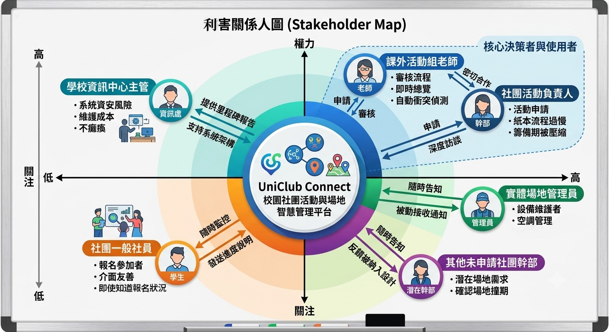

## 0707 工作紙

請將以下內容複製到小組文件或 GitHub Markdown 檔（Markdown file）中。

### A. 小組基本資料

| 欄位     | 內容                           |
| -------- | ------------------------------ |
| 小組名稱 | Group05                        |
| 組員     | 柯佳妘 王寶春                  |
| 專案題目 | 校園社團活動與場地智慧管理平台 |
| 文件版本 | v1                             |
| 日期     | 115/07/07                      |

### B. 7/6 專案章程修正摘要

| 項目         | 原本內容 | 修正後內容 | 修正理由 |
| ------------ | -------- | ---------- | -------- |
| 專案題目     |          |            |          |
| 問題陳述     |          |            |          |
| 範圍內項目   |          |            |          |
| 範圍外項目   |          |            |          |
| 原型核心任務 |          |            |          |

### C. 利害關係人分析表

| 利害關係人（stakeholder） | 是否直接使用系統 | 與系統的關係     | 主要需求 / 痛點                                          | 權力 | 關注 | 分類          |
| ------------------------- | ---------------- | ---------------- | -------------------------------------------------------- | ---- | ---- | ------------- |
| 1.社團活動負責人          | 是               | 活動申請與管理方 | 痛點：現行紙本簽核流程過慢，導致活動籌備期被壓縮。       | 高   | 高   | 內部使用者    |
| 2.課外活動組老師          | 是               | 系統審核與管理方 | 需求：需即時總覽校內所有場地借用狀況，避免資源衝突。     | 高   | 高   | 系統管理者    |
| 3.社團一般社員            | 是               | 活動報名參加者   | 需求：希望有清晰的活動介面能快速報名，避免搶不到名額。   | 中   | 中   | 外部使用者    |
| 4.實體場地管理員          | 否               | 場地資源維護者   | 需求：需確切的場地借用時段通知，以便進行空調與設備管理   | 中   | 高   | 被動接收者    |
| 5.學校資訊中心主管        | 否               | 系統與數據主管   | 需求：關切系統資安風險與維護成本，不希望系統癱瘓         | 高   | 中   | 決策/技術權責 |
| 6.其他未申請社團幹部      | 是               | 潛在場地需求方   | 痛點：難以得知哪些時段已被借走，常需不斷確認是否能借用。 | 中   | 中   | 內部使用者    |

利害關係人圖

### D. 權力 / 關注矩陣

| 類型           | 本組利害關係人                 | 後續需求蒐集策略                                               |
| -------------- | ------------------------------ | -------------------------------------------------------------- |
| 高權力、高關注 | 課外活動組老師、社團活動負責人 | 密切合作，這是核心決策者與使用者，必須定期更新進度並深入訪談。 |
| 高權力、低關注 | 學校資訊中心主管               | 只需提供關鍵里程碑報告，確保他們支持系統架構即可。             |
| 低權力、高關注 | 實體場地管理員、其他社團幹部   | 隨時告知，確保社員的需求與反饋被納入設計，維持其滿意度。       |
| 低權力、低關注 | 社團一般社員                   | 隨時監控，定期發送簡單進度說明，確保介面友善即可。             |

### E. 可行性分析

| 可行性類型                            | 分析內容                                                                                                                                                  | 判斷結果 | 需要調整的範圍                            |
| ------------------------------------- | --------------------------------------------------------------------------------------------------------------------------------------------------------- | -------- | ----------------------------------------- |
| 技術可行性（technical feasibility）   | 使用 Figma 製作系統原型，搭配 GitHub 管理文件，不用與校務系統或正式資料庫串接，因此技術上可以完成。不過若加入即時通知或校務系統登入，開發難度會明顯提高。 | 有風險   | 不實作校務系統（SSO）登入及即時通知功能。 |
| 操作可行性（operational feasibility） | 社團幹部、學生及課外活動組皆有實際使用需求，系統可取代紙本申請流程，提升作業效率。                                                                        | 可行     | 不處理各社團特殊行政流程及例外情況。      |
| 時程可行性（schedule feasibility）    | 本專案只有五週時間，因此只要做主要功能，活動建立、場地申請、線上審核及活動報名等核心功能即可。                                                            | 有風險   | 將金流、聊天室及完整通知系統列為範圍外。  |
| 經濟可行性（economic feasibility）    | 本專案使用 Figma、GitHub 等免費工具即可完成原型，不需租用伺服器或購買商業軟體，因此開發成本低，不許成本要求。                                             | 可行     | 不建置正式伺服器與付費服務。              |

### F. 風險清單第 1 版

| 風險編號 | 風險描述                                    | 影響 | 可能性 | 應對方式                                         |
| -------- | ------------------------------------------- | ---- | ------ | ------------------------------------------------ |
| R1       | 專案功能範圍有點大，五週內可能比較困難      | 高   | 高     | 做主要功能就可行                                 |
| R2       | 組員對 Figma 或 GitHub 操作不熟             | 中   | 中     | 分工合作並先完成基本原型，再逐步增加功能。       |
| R3       | 場地預約流程設計不完整，可能造成重複預約    | 中   | 中     | 加入同一場地同一時段不可重複借用的規則。         |
| R4       | 訪談對象不足，需求可能不夠完整              | 高   | 中     | 訪談社團幹部及同學，並以情境模擬補充需求。       |
| R5       | GitHub 文件版本管理錯誤，導致資料遺失或覆蓋 | 中   | 中     | 每次修改前先 Pull，修改完成立即 Commit 與 Push。 |

### G. 今天新增的範圍外項目

請列出今天做完可行性分析後，決定放入範圍外（out-of-scope）的項目。

1，校務系統（SSO）單一登入整合。

2，線上付款（金流）功能。

3，LINE／Email 即時通知功能。

H. 生成式 AI 使用紀錄（generative AI use log）

若使用生成式 AI（generative AI），請填寫：

| 次數  | 使用目的                           | 提示詞摘要（prompt summary）                                                     | 生成式 AI 產出重點（generative AI output）                         | 採用內容                                                       | 不採用內容/人工修正                                                                 |
| ----- | ---------------------------------- | -------------------------------------------------------------------------------- | ------------------------------------------------------------------ | -------------------------------------------------------------- | ----------------------------------------------------------------------------------- |
| 1.4次 | 找出本組利害關係人後續需求蒐集策略 | 每個利害關係人都要放入矩陣。高權力者不能被忽略，即使他不是主要使用者。           | 協助建立利害關係人的權力關注評估，提供系統分析的專業架構和建議     | 利害關係人的角色分類與職責定義以及關注矩陣的分類邏輯與溝通策略 | 金流支付和跨社團器材維修等功能建議刪除/把利害關係人中的器材管理處改成實體場地管理員 |
| 2     | 完成可行性分析與風險清單           | 根據校園社團活動與場地智慧管理平台，完成可行性分析及風險清單，並提出範圍外項目。 | 提供技術、操作、時程、經濟四項可行性分析，以及五項風險與應對方式。 | 採用可行性分析、風險清單及新增範圍外項目。                     | 依本組專案內容調整描述，刪除不符合五週原型的功能，並修改為符合課程需求。            |
