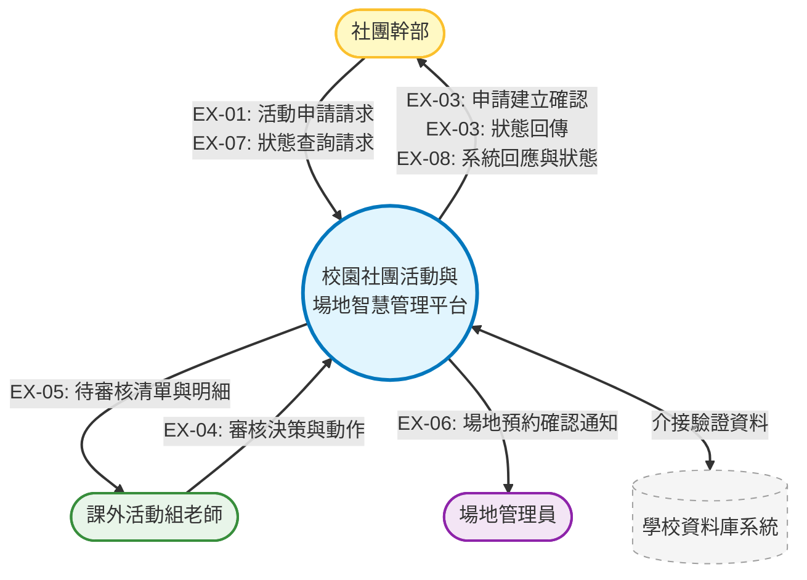

## 系統環境圖

```mermaid
graph TD
    %% 定義外部實體
    E1([社團幹部])
    E2([課外活動組老師])
    E3([場地管理員])
  
    %% 定義核心系統
    SYS((校園社團活動與<br>場地智慧管理平台))
  
    %% 定義資料儲存（環境圖中通常不畫細節，這裡用淺色框示意邊界）
    DB[(學校資料庫系統)]
  
    %% 定義資料流向
    E1 -->|EX-01: 活動申請請求<br>EX-07: 狀態查詢請求| SYS
    SYS -->|EX-03: 申請建立確認<br>EX-03: 狀態回傳<br>EX-08: 系統回應與狀態| E1
  
    E2 -->|EX-04: 審核決策與動作| SYS
    SYS -->|EX-05: 待審核清單與明細| E2
  
    SYS -->|EX-06: 場地預約確認通知| E3
  
    SYS <-->|介接驗證資料| DB

    %% 設定樣式
    linkStyle 0,1,2,3,4,5 stroke-width:2px;
    style SYS fill:#e1f5fe,stroke:#0277bd,stroke-width:3px,rx:10,ry:10
    style E1 fill:#fff9c4,stroke:#fbc02d,stroke-width:2px
    style E2 fill:#e8f5e9,stroke:#388e3c,stroke-width:2px
    style E3 fill:#f3e5f5,stroke:#8e24aa,stroke-width:2px
    style DB fill:#f5f5f5,stroke:#9e9e9e,stroke-width:1px,stroke-dasharray: 5 5
```
