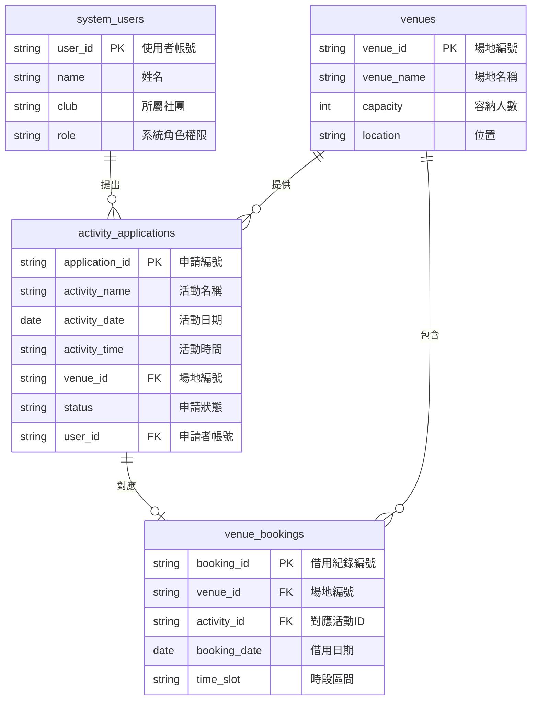

## 實體關係圖 (ERD - Entity-Relationship Diagram)

```mermaid
erDiagram
    system_users {
        string user_id PK "使用者帳號"
        string name "姓名"
        string club "所屬社團"
        string role "系統角色權限"
    }

    activity_applications {
        string application_id PK "申請編號"
        string activity_name "活動名稱"
        date activity_date "活動日期"
        string activity_time "活動時間"
        string venue_id FK "場地編號"
        string status "申請狀態"
        string user_id FK "申請者帳號"
    }

    venue_bookings {
        string booking_id PK "借用紀錄編號"
        string venue_id FK "場地編號"
        string activity_id FK "對應活動ID"
        date booking_date "借用日期"
        string time_slot "時段區間"
    }

    venues {
        string venue_id PK "場地編號"
        string venue_name "場地名稱"
        int capacity "容納人數"
        string location "位置"
    }

    system_users ||--o{ activity_applications : "提出"
    activity_applications ||--o| venue_bookings : "對應"
    venues ||--o{ venue_bookings : "包含"
    venues ||--o{ activity_applications : "提供"
```
