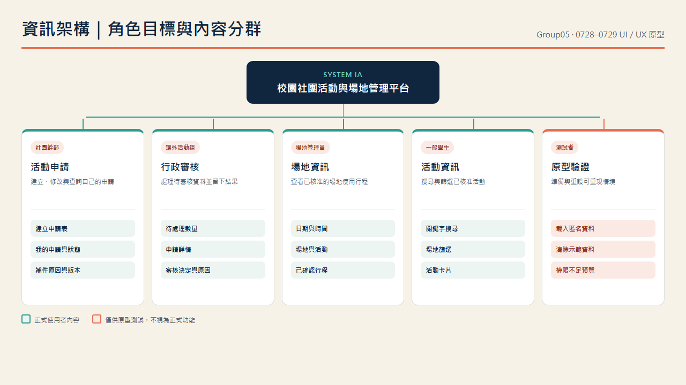

### D. 資訊架構

| 內容群組 | 導覽名稱 | 使用者目標 | 包含內容 | 可見角色 | 命名理由 |
| --- | --- | --- | --- | --- | --- |
| 活動申請 | 社團幹部 | 建立、修改與查詢自己的申請 | 建立申請表、我的申請、補件原因、版本 | 社團幹部 | 使用角色熟悉的「申請」與「補件」，不使用資料表名稱 |
| 行政審核 | 課外活動組 | 處理待審核資料並留下結果 | 待處理數量、申請詳情、審核原因、已處理紀錄 | 課外活動組 | 依工作目標分群，不與社團端混在同一表單 |
| 場地資訊 | 場地管理員 | 查看已核准的場地使用行程 | 日期、時間、場地、活動 | 場地管理員 | 只呈現完成場地確認所需資訊 |
| 活動資訊 | 一般學生 | 搜尋與篩選已核准活動 | 關鍵字、場地篩選、活動卡片 | 一般學生 | 依學生尋找活動的語言命名 |
| 原型驗證 | 狀態工具 | 準備與重設可重現的測試情境 | 載入匿名資料、清除資料、權限不足預覽 | 測試者 | 明確標示為原型驗證，不假裝正式功能 |
